# SQL Concepts Overview & Learning Hub

Welcome to the comprehensive SQL learning hub! This central overview serves as your main navigation point for mastering SQL concepts across the repository, from basic aggregation to advanced analytics patterns. Whether you're preparing for data engineering interviews or building production SQL skills, this guide provides structured pathways through all SQL concepts with practical Netflix examples.

## 🎯 Overview

This hub connects **general SQL concepts** with **company-specific interview problems**, creating a complete learning ecosystem. Each concept includes hyperlinks to detailed explanations and cross-references to real-world Netflix interview examples where the concepts are applied.

## 📚 Complete SQL Concepts Index

### 🟢 **Core SQL Fundamentals**

- **[Aggregate Functions](aggregation/aggregate-functions.md)** - SUM, COUNT, AVG, MIN, MAX with practical examples
- **[Monthly Ratings Analysis](aggregation/monthly-ratings.md)** - Real-world grouping and time-based aggregation

### 🟡 **Data Relationships & Joins**

- **[JOINs and Relationships](joins/page-impressions-analysis.md)** - Multi-table analysis and data relationships
- **[Page Impressions Analysis](joins/page-impressions-analysis.md)** - Business-focused JOIN patterns
- **[Subqueries](subqueries/subqueries.md)** - Correlated and non-correlated subquery patterns

### 🟠 **Advanced SQL Techniques**

- **[Common Table Expressions (CTEs)](cte/cte-vs-window-comparison.md)** - Modular query building and complex analysis
  - [CTE vs Window Functions](cte/cte-vs-window-comparison.md) - Choosing the right approach
  - [Customer Sales Analysis](cte/customer-sales-analysis.md) - Multi-step analytical queries
  - [Vacant Days Analysis](cte/vacant-days-detailed.md) - Recursive CTEs for date ranges
- **[Window Functions](window-functions/README.md)** - Advanced analytics and ranking operations
  - [Window Functions Overview](window-functions/window-functions-overview.md) - Complete guide
  - [PostgreSQL Interview Examples](window-functions/postgresql-interview-examples.md) - Interview-focused problems
  - [Ranking Functions](window-functions/postgresql-ranking-functions.md) - ROW_NUMBER, RANK, DENSE_RANK
  - [Navigation Functions](window-functions/postgresql-navigation-functions.md) - LAG, LEAD, FIRST_VALUE, LAST_VALUE
  - [Advanced Concepts](window-functions/postgresql-advanced-concepts.md) - Frames and complex patterns
  - [Window Average Comparison](window-functions/window-avg-comparison.md) - Performance vs accuracy trade-offs

### 🔴 **Advanced Patterns & Optimization**

- **[Advanced SQL Patterns](advanced/advanced-sql-patterns.md)** - Complex query patterns and techniques
- **[SQL Optimization](optimization/sql-optimization-challenges.md)** - Performance tuning and optimization strategies

### 📚 **Practice Exercises & Interview Preparation**

#### **Comprehensive SQL Exercise Collections**

- **[SQL Exercises from Wikibooks](extras/wikibooks.md)** - Complete collection of hands-on SQL exercises organized by difficulty level
  - Beginner: Basic analytics, aggregation, and simple joins
  - Intermediate: Window functions, ranking, and complex patterns
  - Advanced: CTEs, recursive queries, and optimization techniques
  - Includes detailed solutions, explanations, and cross-references to main concepts

- **[TopTal SQL Interview Questions](extras/toptal.md)** - Real-world SQL interview challenges for streaming/media companies
  - Business-focused problems with complete context and solutions
  - Covers user analytics, content performance, and recommendation systems
  - Includes optimization challenges and performance considerations

#### **Structured Exercise Directories**

- **[Wikibooks Exercise Directory](extras/wikibooks.md)** - Organized practice exercises with schema and sample data
- **[TopTal Interview Directory](extras/toptal.md)** - Advanced interview questions with business context and performance analysis

## 🏢 SQL Concepts in Netflix Interview Problems

### 🟢 **Basic Analytics** ([Full Category](problems/01-basic-analytics/README.md))

Fundamental SQL analytics focusing on data aggregation and basic metrics.

| Concept | Netflix Example | Key Skills |
|---------|----------------|------------|
| **COUNT DISTINCT** | [Daily Active Users](problems/01-basic-analytics/daily-active-users.md) | User metrics, date aggregation |
| **Date Arithmetic** | [Day 1 Retention](problems/01-basic-analytics/day-1-retention.md) | User retention, self-joins |
| **Basic Aggregation** | [Most Watched Show Per Day](problems/01-basic-analytics/most-watched-show-per-day.md) | Content analytics, ranking |

**Primary Concepts Used**: Aggregation functions, GROUP BY, date functions, basic filtering

---

### 🟡 **Window Functions & Ranking** ([Full Category](problems/02-ranking-window-functions/README.md))

Advanced problems using window functions and ranking operations.

| Concept | Netflix Example | Key Skills |
|---------|----------------|------------|
| **DENSE_RANK()** | [Top 3 Shows per Region](problems/02-ranking-window-functions/top-3-shows-per-region.md) | Regional rankings, content performance |
| **LAG/LEAD Functions** | [Consecutive Days Watching](problems/02-ranking-window-functions/consecutive-days-watching.md) | User behavior patterns, CTEs |
| **PERCENTILE_CONT()** | Advanced statistical patterns covered in ranking examples | Statistical analysis, user segmentation |

**Primary Concepts Used**: Window functions, PARTITION BY, ORDER BY, CTEs, statistical functions

---

### 🟠 **Advanced Patterns** ([Full Document](problems/advanced-patterns.md))

Complex SQL patterns including recursive queries and advanced analytics.

| Pattern | Application | Difficulty |
|---------|-------------|------------|
| **Recursive CTEs** | Employee hierarchy, organizational charts | 🟠 Hard |
| **Multi-CTE Analysis** | Customer lifetime value segmentation | 🟠 Hard |
| **Correlation Analysis** | Content recommendation analysis | 🟠 Hard |
| **Statistical Modeling** | Financial fraud detection | 🔴 Expert |

**Primary Concepts Used**: Recursive CTEs, complex analytics, statistical functions, multi-step problem solving

---

### 🔴 **Optimization & Performance** ([Full Document](problems/optimization-challenges.md))

Query performance optimization and indexing strategies.

| Focus Area | Skills Covered |
|------------|----------------|
| **Query Optimization** | Execution planning, performance tuning |
| **Indexing Strategies** | Index selection, query structure |
| **Large-Scale Data** | Scalability considerations, resource usage |

**Primary Concepts Used**: Performance optimization, indexing, query execution planning

## 🎯 Learning Progression & Difficulty Levels

```mermaid
graph TD
    A[Start: Basic SQL] --> B[🟢 Aggregate Functions]
    B --> C[🟡 JOINs & Subqueries]
    C --> D[🟠 CTEs]
    D --> E[🟠 Window Functions]
    E --> F[🔴 Advanced Patterns]
    F --> G[🔴 Optimization]

    style A fill:#90EE90
    style B fill:#90EE90
    style C fill:#FFD700
    style D fill:#FFA500
    style E fill:#FFA500
    style F fill:#FF6347
    style G fill:#FF6347

```

### 🟢 **Beginner Level** (4-6 hours)

**Focus**: Build SQL confidence with core operations and hands-on practice

1. [Aggregate Functions](aggregation/aggregate-functions.md)
2. [Basic Analytics Problems](problems/01-basic-analytics/README.md)
3. **[Wikibooks Beginner Exercises](extras/wikibooks.md#beginner-level-basic-analytics)** - Practice DAU, retention, and content analytics

4. **Key Skills**: COUNT, SUM, AVG, GROUP BY, basic filtering, user metrics

### 🟡 **Intermediate Level** (6-10 hours)

**Focus**: Master data relationships, window functions, and complex patterns

1. [JOINs and Relationships](joins/page-impressions-analysis.md)
2. [Subqueries](subqueries/subqueries.md)
3. **[Wikibooks Window Functions Exercises](extras/wikibooks.md#intermediate-level-window-functions--ranking)** - Practice ranking and navigation functions
4. **[TopTal Intermediate Questions](extras/toptal.md#intermediate-level)** - Real-world ranking and analytics problems
5. **Key Skills**: Multi-table queries, correlated subqueries, window functions, ranking

### 🟠 **Advanced Level** (10-18 hours)

**Focus**: Complex analytical patterns, CTEs, and optimization techniques

1. [CTEs Overview](cte/cte-vs-window-comparison.md)
2. [Window Functions Overview](window-functions/window-functions-overview.md)
3. [Ranking Problems](problems/02-ranking-window-functions/README.md)
4. **[Wikibooks Advanced Patterns](extras/wikibooks.md#advanced-level-complex-patterns--optimization)** - CTEs, recursive queries, and percentile analysis

5. **[TopTal Advanced Questions](extras/toptal.md#advanced-level)** - Heavy watchers retention, content hierarchy, statistical functions

6. **Key Skills**: CTEs, window functions, ranking, recursive queries, statistical analysis

### 🔴 **Expert Level** (18+ hours)

**Focus**: Production-ready SQL, performance optimization, and large-scale challenges

1. [Advanced Patterns](problems/advanced-patterns.md)
2. [Optimization Challenges](problems/optimization-challenges.md)
3. **[TopTal Optimization Challenges](extras/toptal.md#optimization-challenges)** - Efficient DAU calculation, partitioning strategies, Top-N queries

4. **[Wikibooks Optimization Exercises](extras/wikibooks.md#advanced-level-complex-patterns--optimization)** - Query performance optimization and indexing strategies

5. **Key Skills**: Recursive queries, performance tuning, large-scale optimization, indexing, partitioning

## 🔗 Concept-to-Example Mapping

### From SQL Concepts to Netflix Problems

| SQL Concept | Netflix Interview Problems | Why It Matters |
|-------------|----------------------------|----------------|
| **Aggregate Functions** | [Daily Active Users](problems/01-basic-analytics/daily-active-users.md) | Core business metrics |
| **Window Functions** | [Top 3 Shows per Region](problems/02-ranking-window-functions/top-3-shows-per-region.md) | Content performance analysis |
| **CTEs** | [Consecutive Days Watching](problems/02-ranking-window-functions/consecutive-days-watching.md) | User behavior patterns |
| **Recursive CTEs** | [Advanced Patterns](problems/advanced-patterns.md) | Hierarchical data problems |

### From Interview Problems to SQL Concepts

| Netflix Problem | SQL Concepts Demonstrated |
|-----------------|---------------------------|
| **DAU Calculation** | COUNT DISTINCT, GROUP BY, date functions |
| **Top-N Queries** | DENSE_RANK, PARTITION BY, window functions |
| **Retention Analysis** | Self-joins, date arithmetic, percentage calculations |
| **Consecutive Patterns** | LAG/LEAD, CTEs, window functions |

## 📊 Difficulty Assessment by Category

| Category | Difficulty | Time to Learn | Interview Frequency | Business Value |
|----------|------------|---------------|-------------------|---------------|
| **Basic Analytics** | 🟢 Easy | 4-6 hours | Very High | High |
| **JOINs & Subqueries** | 🟡 Medium | 6-10 hours | High | High |
| **Window Functions** | 🟠 Hard | 10-18 hours | Very High | Very High |
| **CTEs** | 🟠 Hard | 8-16 hours | Medium | High |
| **Advanced Patterns** | 🔴 Expert | 18+ hours | Low | Very High |
| **Optimization** | 🔴 Expert | 18+ hours | Low | Critical |
| **Practice Exercises** | 🟢-🔴 Varies | 8-20 hours | High | Very High |

## 🛠️ Preparation Strategy by Role

### For Data Analyst Roles

1. **Master Basic Analytics** (🟢) - Focus on aggregation and reporting
2. **Learn Window Functions** (🟠) - Essential for business intelligence
3. **Practice Netflix Examples** - Real-world application patterns

### For Data Engineering Roles

1. **All Basic Concepts** (🟢🟡) - Foundation for complex queries
2. **Advanced Patterns** (🟠🔴) - Production-ready SQL
3. **Performance Optimization** (🔴) - Scale and efficiency

### For Interview Preparation

1. **Follow Learning Progression** - Start with basics, progress to advanced patterns
2. **Practice Netflix Problems** - Industry-standard challenges with real-world context
3. **[Complete Wikibooks Exercises](extras/wikibooks.md)** - Build foundational skills with structured exercises
4. **[Master TopTal Challenges](extras/toptal.md)** - Practice streaming/media interview scenarios
5. **Master Window Functions** - 70% of SQL interviews focus here, with hands-on practice

## 🎯 Comprehensive Practice Resources

This SQL hub provides multiple pathways for skill development, from foundational concepts to interview-ready proficiency:

### **Practice Collections by Focus Area**

| Focus Area | Wikibooks Exercises | TopTal Challenges | Netflix Problems | Best For |
|------------|-------------------|-------------------|------------------|----------|
| **Basic Analytics** | [DAU, Retention, Content Analytics](extras/wikibooks.md#beginner-level-basic-analytics) | [User Metrics, Basic Aggregation](extras/toptal.md#beginner-level) | [Daily Active Users, Most Watched Show](problems/01-basic-analytics/README.md) | Building confidence with core SQL |

| **Window Functions** | [Ranking, Navigation Functions](extras/wikibooks.md#intermediate-level-window-functions--ranking) | [Top-N, Consecutive Patterns](extras/toptal.md#intermediate-level) | [Top 3 Shows, Consecutive Days](problems/02-ranking-window-functions/README.md) | Mastering advanced analytics |

| **CTEs & Complex Patterns** | [Heavy Watchers, Content Hierarchy](extras/wikibooks.md#advanced-level-complex-patterns--optimization) | [Retention Analysis, Recursive CTEs](extras/toptal.md#advanced-level) | [Advanced Patterns](problems/advanced-patterns.md) | Complex problem solving |

| **Optimization** | [Query Performance, Indexing](extras/wikibooks.md#advanced-level-complex-patterns--optimization) | [Efficient DAU, Partitioning](extras/toptal.md#optimization-challenges) | [Optimization Challenges](problems/optimization-challenges.md) | Production-ready SQL |

### **Recommended Learning Sequence**

1. **Start with Wikibooks** - Structured exercises to build foundational skills
2. **Apply with TopTal** - Real-world interview scenarios and business context
3. **Practice with Netflix** - Industry-specific problems and advanced patterns
4. **Master Optimization** - Performance tuning and large-scale considerations

## 🎯 Success Metrics

**Beginner Level**:

- ✅ Write basic aggregation queries
- ✅ Understand JOIN relationships
- ✅ Solve simple Netflix problems

**Intermediate Level**:

- ✅ Use subqueries effectively
- ✅ Handle date-based analytics
- ✅ Optimize basic query performance

**Advanced Level**:

- ✅ Implement complex window functions
- ✅ Build multi-step CTEs
- ✅ Solve ranking and analytics problems

**Expert Level**:

- ✅ Design recursive query solutions
- ✅ Optimize complex analytical queries
- ✅ Handle large-scale data challenges

## 📚 Additional Resources & Cross-References

### Related Learning Areas

- **[Data Modeling](../data-modeling/README.md)** - Understanding database design patterns
- **[Netflix Data Modeling](../data-modeling/README.md)** - Real-world applications
- **[Performance Optimization](problems/optimization-challenges.md)** - Query tuning strategies

### Practice & Exercise Collections

- **[SQL Exercises from Wikibooks](extras/wikibooks.md)** - Comprehensive hands-on exercises by difficulty level
- **[TopTal Interview Questions](extras/toptal.md)** - Streaming/media-focused SQL interview challenges
- **[Wikibooks Exercise Directory](extras/wikibooks.md)** - Organized practice exercises with detailed solutions
- **[TopTal Interview Directory](extras/toptal.md)** - Advanced problems with business context and performance analysis

### External Resources

- **PostgreSQL Documentation** - Official reference for advanced SQL features
- **SQL Window Functions Cheat Sheet** - Quick reference guide
- **Database Indexing Guide** - Performance optimization techniques

## 🔗 Navigation & Next Steps

- [⬅️ **Back to Main Concepts**](../README.md)
- [📊 **Next: Data Modeling Concepts**](../data-modeling/README.md)
- [🏢 **Company Interview Prep**](../../interviews/README.md)
- [🎯 **Start Learning: Aggregate Functions**](aggregation/aggregate-functions.md)
- [📚 **Practice Exercises: Wikibooks Collection**](extras/wikibooks.md)
- [🎯 **Interview Practice: TopTal Challenges**](extras/toptal.md)

---

*This SQL Concepts Overview serves as your central hub for mastering SQL. Start with the basics, progress systematically through each difficulty level, and apply concepts to real Netflix interview problems. Remember: consistent practice with practical examples is the key to SQL mastery!*
